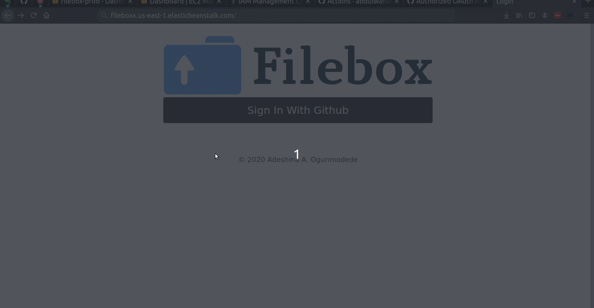

## Overview

A simple web-based file storage service built ontop of AWS infrastructure. As shown in the demo below, users signin
 with their Github account and can upload files from their computer A more thorough discussion of this project can be
  found on my portfolio sites at [abdulwahabo.github.io/filebox](https://abdulwahabo.github.io/filebox) 
  


## Tech Stack

* Java 11 - For writing most of the application code.
* Spring Boot - Java web framework.
* AWS DynamoDB - NoSQL store for persisting user data and file metadata.
* AWS S3 - For secure storage of the actual files.
* AWS Elastic Beanstalk - For conveniently deploying the application to an AWS production environment.

## Deploying Locally

To deploy this project on your local machine you'll need a Github OAuth app and AWS credentials. Also, a Maven
 profile (in `settings.xml`) with properties as shown below. 
 
```xml
  <profile>
	<id>filebox-local</id>
	<properties>
		<aws.s3.bucket>{TODO}</aws.s3.bucket>
		<aws.dynamo.user.table>{TODO}</aws.dynamo.user.table>
		<aws.s3.region>{TODO}</aws.s3.region>
		<aws.dynamo.region>{TODO}</aws.dynamo.region>
		<github.client.secret>{TODO}</github.client.secret>
		<github.client.id>{TODO}</github.client.id>
		<filebox.host>{TODO}</filebox.host>
		<filebox.port>{TODO}</filebox.port>	
	</properties>
  </profile>
```

The application can be started using the Spring Boot Maven plugin i.e `mvn spring-boot:run -Pfilebox-local`. I
 describe the AWS production setup on my portfolio site.
 